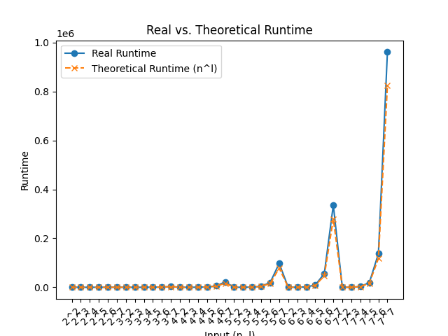

quantum_rfs
==============================
[//]: # (Badges)

A Python package for running, testing, and visualizing concrete examples of both quantum and classical solutions to the Recursive Fourier Sampling problem. The quantum solution is based on the Bernstein-Vazirani algorithm, while the classical solution brute forces a recursion tree.

Graph showing runtime of the package's classical solution, compared to its theoretical runtime.

### Copyright

Copyright (c) 2025, Joshua Gao

#### Acknowledgements
 
Project based on the 
[Computational Molecular Science Python Cookiecutter](https://github.com/molssi/cookiecutter-cms) version 1.10.
